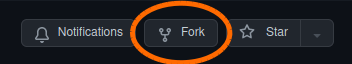

# &#x00a1;Arm&#x00e1; tus links personalizados! &#x1f517;

_&#x00a1;en 30 segundos o menos!_

## Para Ansiosos &#x1f3ce;

    GIF ANIMADO CON TODO EL PROCESO

---

1. [Empecemos (5 segundos)](#empecemos)
2. [Creemos una cuenta de GitHub (20 segundos)](#creemos-una-cuenta-de-github)
3. [Copiando el proyecto (5 segundos)](#copiando-el-proyecto)

---

<!-- markdownlint-disable-next-line MD033 -->

## &#x1f7e2;&#x26aa;&#x26aa; Empecemos &#x1f3c1;

Para tener tus propios links, necesit&#x00e1;s una cuenta en GitHub.
GitHub es como una red social para proyectos.

&#x00bf;Ya ten&#x00e9;s cuenta de GitHub?

### S&#x00cd; &#x1f9d0;

&#x00a1;Genial! segu&#x00ed; [**ac&#x00e1;**](#copiando-el-proyecto).

### NO &#x1f97a;

&#x00a1;No hay problema! armemos una [**ac&#x00e1;**](#creemos-una-cuenta-de-github).

<!-- markdownlint-disable-next-line MD033 -->

## &#x1f7e2;&#x1f7e2;&#x26aa; Creemos una cuenta de GitHub &#x1f419;&#x1f431;

Las cuentas de GitHub son **gratis**, y s&#x00f3;lo requieren una direcci&#x00f3;n de mail que puedas validar. Registrar una cuenta es muy f&#x00e1;cil, s&#x00f3;lo ten&#x00e9;s que seguir estos pasos:

Iniciar el proceso
: &#x1f7e2;&#x26aa;&#x26aa;&#x26aa;&#x26aa;&#x26aa;&#x26aa;
: > **IMPORTANTE:** Para que puedas seguir estos pasos, te sugerimos abrir los links en una nueva ventana / tab.
Hac&#x00e9; click derecho en el link &#x1f5b1; y seleccion&#x00e1; _"abrir en una pestaña nueva"_ o _"abrir en una p&#x00e1;gina nueva"_.

: Para comenzar, and&#x00e1; arriba de todo en esta p&#x00e1;gina, y hac&#x00e9; click en el bot&#x00f3;n que dice **Sign up**:

: 

: Tambi&#x00e9;n pod&#x00e9;s hacer link [**ac&#x00e1; &#x270d;**](https://github.com/signup) &#x00a1;y te llevamos directo para all&#x00e1;!

<!-- markdownlint-disable-next-line MD033 -->
Completar tu email
: &#x1f7e2;&#x1f7e2;&#x26aa;&#x26aa;&#x26aa;&#x26aa;&#x26aa;
: Complet&#x00e1; el cuadro de texto marcado con **1** con una cuenta de mail que puedas validar (ie. a la que tengas acceso inmediato), y hac&#x00e9; lcick en el bot&#x00f3;n **Continue** marcado con **2**.

: 

Elegir una password
: &#x1f7e2;&#x1f7e2;&#x1f7e2;&#x26aa;&#x26aa;&#x26aa;&#x26aa;
: Complet&#x00e1; el cuadro de texto marcado con **1** con una password que recuerdes, y hac&#x00e9; lcick en el bot&#x00f3;n **Continue** marcado con **2**.

: 

Elegir un nombre de usuario
: &#x1f7e2;&#x1f7e2;&#x1f7e2;&#x1f7e2;&#x26aa;&#x26aa;&#x26aa;
: > Un "nombre de usuario" no es m&#x00e1;s que un nickname con el cual GitHub te va a identificar.
No es muy importante qu&#x00e9; pongas ac&#x00e1;.
Te recomendamos que pongas tu mismo nombre de usuario de email, o que te inventes algo divertido.

: Complet&#x00e1; tu nombre de usuario en el cuadro de texto marcado con **1**, y hac&#x00e9; click en el bot&#x00f3;n **Continue** marcado con **2**.

: 

Elegir si recibir promociones o no
: &#x1f7e2;&#x1f7e2;&#x1f7e2;&#x1f7e2;&#x1f7e2;&#x26aa;&#x26aa;
: GitHub te puede mandar mails de promos y difusi&#x00f3;n.
Si quer&#x00e9;s recibir estos mails, pon&#x00e9; `y`, si no, pon&#x00e9; `n` en el cuadro de texto marcado con **1**, y hac&#x00e9; click en el bot&#x00f3;n **Continue** marcado con **2**.

: 

Completar un desf&#x00ed;o
: &#x1f7e2;&#x1f7e2;&#x1f7e2;&#x1f7e2;&#x1f7e2;&#x1f7e2;&#x26aa;
: Para validar que sos un ser humano (en vez de una m&#x00e1;quina haciendo este mismo proceso autom&#x00e1;ticamente), GitHub te va a pedir completar un desaf&#x00ed;o sencillo (tambi&#x00e9;n conocido como "CAPTCHA").

: Hac&#x00e9; click en el bot&#x00f3;n **Start puzzle** marcado y complet&#x00e1; el desaf&#x00ed;o.

: 

Validar tu email
: &#x1f7e2;&#x1f7e2;&#x1f7e2;&#x1f7e2;&#x1f7e2;&#x1f7e2;&#x1f7e2;
: Por último, hac&#x00e9; click en el bot&#x00f3;n **Create account** que va a aparecer debajo.

: 

: Eso te va a llevar a la pantalla de validaci&#x00f3;n.

: Ahora, entr&#x00e1; a [la casilla de mails que pusiste en el primer paso](#completar-tu-email), busc&#x00e1; el mail de GitHub (si no lo ves, fijate si no fue a parar a la carpeta de Spam), y copi&#x00e1; el c&#x00f3;digo de 8 d&#x00ed;gitos que te mandaron en los casilleros marcados.

: 

<!-- markdownlint-disable-next-line MD033 -->

## &#x1f7e2;&#x1f7e2;&#x1f7e2; Copiando el proyecto &#x1f9e9;

> En GitHub, una copia de un proyecto se llama un _**fork**_.
Un fork tiene todo lo mismo que tiene el proyecto copiado, y te permite personalizar tu copia individual como vos quieras.

Hacer un fork del proyecto es muy sencillo, s&#x00f3;lo ten&#x00e9;s que hacer click en **Fork** arriba a la derecha.

Tambi&#x00e9;n pod&#x00e9;s hacer click [ac&#x00e1; &#x1f9ec;](https://github.com/lacrypta/.hodl.ar/fork) &#x00a1;y te llevamos directo para all&#x00e1;!

En la pantalla siguiente, verific&#x00e1; que tu nombre de usuario de GitHub aparezca en el menú marcado con **1**, que el nombre del repositorio forkeado sea `.hodl.ar` en el cuadro de texto marcado como **2**, agreg&#x00e1; o cambi&#x00e1; la descripci&#x00f3;n en el cuadro de texto marcado como **3**, y hac&#x00e9; click en el bot&#x00f3;n **Create fork** marcado como **4**.

&#x1f973; &#x1f389; &#x1f38a; &#x1f3c6; **&#x00a1;Felicitaciones!** &#x1f3c6; &#x1f38a; &#x1f389; &#x1f973;

<!--
# &#x00a1;Bienvenido! &#x1f9c9;&#x1f1e6;&#x1f1f7;

## Primero... &#x00bf;d&#x00f3;nde estoy?

Esto es GitHub, una especie de red social para compartir proyectos.

## &#x00bf;Qu&#x00e9; voy a hacer?

- Crearte una cuenta de Github (es **gratis**) (17 segundos).
- Copiar un proyecto con 1 click (6 segundos).
- Modificar un archivo (25 segundos).

## &#x00bf;Cu&#x00e1;nto me va a llevar?

17 + 6 + 25 = 48 segundos.

## &#x00bf;C&#x00f3;mo hago?

Segu&#x00ed; las intrucciones...

## &#x00bf;Ya ten&#x00e9;s cuenta de GitHub?

Hac&#x00e9; click en la opci&#x00f3;n &#x1f447;

[**NO** (&#x00a1;quiero una!)](./GITHUB_SIGNUP.md)

[**S&#x00cd;** (soy grosso)](./FORK.md)
-->